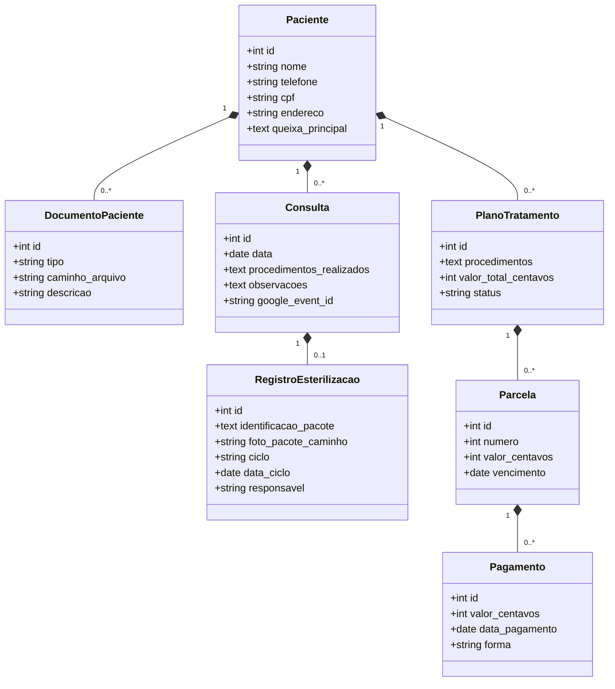
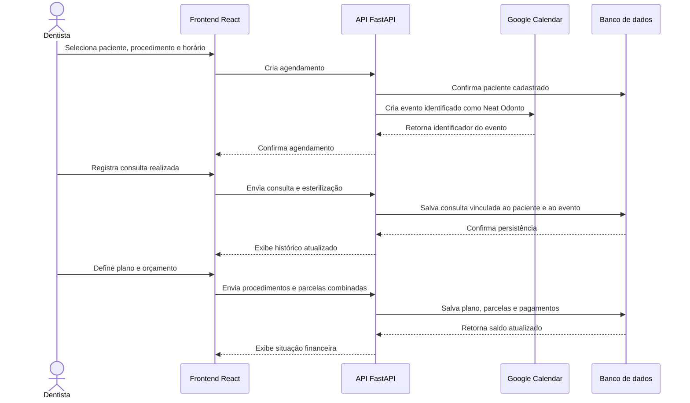

# Neat Odonto

Trabalho de Engenharia de Software 1

---

## Equipe

| Nome completo | Papel técnico | Papel Scrum |
| --- | --- | --- |
| Izabela Esber Xavier | Fullstack | Product Owner / Developer |
| Paulo Henrique Carmona Ramos | Fullstack | Developer |
| Vitor Faleiro Campos Alves | Fullstack | Scrum Master / Developer |
| Lara Amélia Maia de Freitas | Fullstack | Developer |

---
## Objetivo do Sistema
 
O Neat Odonto é um sistema web para gestão de consultórios odontológicos de pequeno porte, voltado para dentistas que ainda dependem de planilhas para a sua organização. O sistema possui cadastro de pacientes com anamnese e documentos clínicos (fotos, radiografias e exames), o histórico de consultas realizadas e o plano de tratamento com orçamento e controle de parcelas pagas. O diferencial do nosso sistema é o registro dos dados de esterilização a cada consulta — pacote, lote, ciclo, data e responsável —, exigência sanitária que hoje costuma ser cumprida em cadernos avulsos e de difícil acompanhamento. A agenda do profissional é integrada ao Google Agenda, evitando que ele mantenha dois calendários.
 
---
 
## Tecnologias
 
**Frontend**
 
- React 18 + Vite
- React Router

**Backend**
 
- Python 3.11 + FastAPI
- SQLAlchemy (ORM) + Alembic (migrações)
- Google OAuth 2.0 (autenticação) + Google Calendar API - ainda em decisão

**Banco de dados**
 
- PostgreSQL (produção) / SQLite (desenvolvimento local)
  
**Armazenamento de arquivos**
 
- Sistema de arquivos local, com caminho referenciado no banco
  
**Agentes de IA**
 
- Claude Code
- Codex
- Cursor
---

## User Stories

**1. Login Dentista**

Como dentista, eu gostaria de fazer login com o meu e-mail do Google, que esteja conectado ao Google Agenda, e uma senha, para que só eu tenha acesso aos dados dos meus pacientes.

**2. Agenda Integrada**

Como dentista, eu gostaria de acessar uma agenda integrada com a minha agenda do Google, podendo inserir consultas, com datas e horários.

**3. Cadastro de Paciente**

Como dentista, eu gostaria de fazer o cadastro e edição de cada paciente, com informações pessoais (CPF, nome, idade, e-mail), anamnese e documentos (fotos, radiografias e exames).

**4. Lista de Pacientes**

Como dentista, eu gostaria de ver uma lista de todos os meus pacientes e filtrá-la por nome.

**5. Busca Rápida de Paciente** 

Como dentista, eu gostaria de buscar rapidamente um paciente pelo nome ou CPF, para que eu encontre seu cadastro com mais facilidade.

**6. Registro de Consultas**

Como dentista, eu gostaria de adicionar e consultar, para cada paciente, as consultas realizadas por data e os procedimentos realizados.

**7. Informações de Esterilização**

Como dentista, eu gostaria de adicionar em cada consulta informações sobre o pacote de esterilização utilizado, como foto do pacote, lote, ciclo/data e nome do responsável pela esterilização.

**8. Plano de Tratamento e Orçamento**

Como dentista, eu gostaria de adicionar em cada paciente um plano de tratamento, que inclui os nomes dos procedimentos realizados e o orçamento combinado para eles, com o número de parcelas totais e já pagas.

---

## Documentação UML preliminar

Os diagramas abaixo representam o domínio atual e o fluxo principal do sistema.

### Diagrama de classes

### Diagrama de sequência: agendar, atender e registrar plano

